# 🛡️ AdGuard Filter

A web application that integrates with [AdGuard Home](https://adguard.com/en/adguard-home/overview.html) to manage blocked services with scheduled automatic resets. Block or unblock services through a modern UI and set timers to automatically restore your default configuration.

## Features

- **Dynamic Service List** — Fetches all available services directly from your AdGuard Home instance
- **Block/Unblock Services** — Toggle individual services on or off through the web UI
- **Quick Block Group** — One-click toggle to block YouTube, Roblox, Spotify, and Spotify Video together
- **Timed Blocking** — Set a duration (minutes) or a specific date/time for blocks to automatically reset
- **Duration Presets** — Quick buttons for 1h, 2h, 4h, 8h, and 3d durations
- **Active Timer Display** — Real-time countdown showing when services will be reset
- **Configurable Defaults** — Default blocked services list can be overridden via environment variable
- **Auto Re-authentication** — Transparent session management with AdGuard Home API

## Architecture

```mermaid
graph LR
    A["🌐 React Frontend<br/>(Vite + TypeScript + Tailwind)"] -->|"HTTP"| B["⚙️ Go Backend<br/>(Fiber v2)"]
    B -->|"HTTP"| C["🛡️ AdGuard Home<br/>API"]
```



- **Backend**: Go 1.25 with [Fiber](https://gofiber.io/) v2
- **Frontend**: React 19 + TypeScript + Vite + Tailwind CSS
- **Containerization**: Multi-stage Docker build on Alpine

## Project Structure

```
adguardfilter/
├── main.go                  # Application entry point
├── adguardapi/              # AdGuard Home API client (auth, CRUD, reset)
├── api/                     # HTTP handler functions
├── transport/               # Fiber router setup and static file serving
├── model/                   # Data structures (ServiceConfig, BlockedService, etc.)
├── common/
│   ├── logger/              # Logging utility
│   ├── timer/               # Timer management for scheduled resets
│   ├── httpclient/          # HTTP client utilities
│   └── servicelist/         # Static service list (legacy fallback)
├── frontend-adguardfilter/  # React frontend application
│   └── src/
│       └── App.tsx          # Main UI component
├── docker/                  # Docker startup scripts
├── Dockerfile               # Multi-stage build
├── filter.json              # Default filter configuration
├── .env.sample              # Environment variable template
└── go.mod                   # Go module definition
```

## Getting Started

### Prerequisites

- [Go](https://go.dev/) 1.25+
- [Node.js](https://nodejs.org/) 22+
- An [AdGuard Home](https://adguard.com/en/adguard-home/overview.html) instance

### Configuration

Copy `.env.sample` to `.env` and update the values:

```env
logLevel=Deb                                    # Log level (Deb, Info, Warn, Err)
logPath=adguardfilter                           # Log file path prefix
Environment=Dev                                 # Dev serves frontend from ./frontend-adguardfilter/dist
authBaseURL=http://adguard.k8s.localdomain      # AdGuard Home base URL
authUsername=admin                               # AdGuard Home username
authPassword=your_password                       # AdGuard Home password
backendUri=http://localhost:3000                 # Backend URI (used by frontend)
PORT=3000                                        # Server port (default: 3000)
# defaultBlockedServices=youtube,roblox,spotify  # Override default reset list (comma-separated)
```

### Run Locally

1. **Install frontend dependencies and build:**

   ```bash
   cd frontend-adguardfilter
   npm install
   npm run build
   cd ..
   ```

2. **Run the Go backend:**

   ```bash
   go run main.go
   ```

3. Open [http://localhost:3000](http://localhost:3000) in your browser.

> In `Dev` mode the frontend is served from `./frontend-adguardfilter/dist`. For frontend development with hot reload, run `npm run dev` inside `frontend-adguardfilter/` and point it at the backend.

### Docker

Build and run with Docker:

```bash
docker build -t adguardfilter .
docker run -d \
  -p 3000:3000 \
  -e authBaseURL=http://your-adguard-host \
  -e authUsername=admin \
  -e authPassword=your_password \
  -e backendUri=http://localhost:3000 \
  adguardfilter
```

## API Reference

| Method | Endpoint | Description |
|--------|----------|-------------|
| `GET` | `/api/v1/getservicelist` | Get all available services from AdGuard Home |
| `GET` | `/api/v1/getblockedservices` | Get currently blocked service IDs and schedule |
| `GET` | `/api/v1/gettimer` | Get active timer status and remaining time |
| `POST/PUT` | `/api/v1/updateblockedservicesmin` | Update blocked services with a minute-based reset timer |
| `POST/PUT` | `/api/v1/updateblockedservicesdatetime` | Update blocked services with a date/time-based reset |

### Example Requests

**Block services with a 2-minute reset timer:**

```bash
curl -X POST http://localhost:3000/api/v1/updateblockedservicesmin \
  -H "Content-Type: application/json" \
  -d '{
    "config": {
      "schedule": { "time_zone": "America/Chicago" },
      "ids": ["youtube", "roblox", "spotify", "spotify_video"]
    },
    "reset_after_min": 2
  }'
```

**Block services until a specific date/time:**

```bash
curl -X POST http://localhost:3000/api/v1/updateblockedservicesdatetime \
  -H "Content-Type: application/json" \
  -d '{
    "config": {
      "schedule": { "time_zone": "America/Chicago" },
      "ids": ["youtube", "roblox", "spotify", "spotify_video"]
    },
    "reset_date_time": "2025-10-12T22:39:00"
  }'
```

## Environment Variables

| Variable | Required | Default | Description |
|----------|----------|---------|-------------|
| `authBaseURL` | Yes | — | AdGuard Home base URL |
| `authUsername` | Yes | — | AdGuard Home admin username |
| `authPassword` | Yes | — | AdGuard Home admin password |
| `PORT` | No | `3000` | Server listen port |
| `Environment` | No | — | Set to `Dev` to serve frontend from local build |
| `backendUri` | No | `http://localhost:3000` | Backend URI injected into frontend |
| `logLevel` | No | — | Logging level (`Deb`, `Info`, `Warn`, `Err`) |
| `logPath` | No | — | Log file path prefix |
| `defaultBlockedServices` | No | Built-in list | Comma-separated service IDs for the default reset configuration |

## License

This project is provided as-is for personal use.
